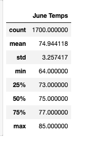
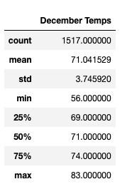

# Surfs_up

## Overview :

An investor wants to learn more about the weather before committing to invest in a Surf and Shake shop in Oahu, Hawaii. Specifically, he wants temperature data for the months of June and December in Oahu, in order to determine if the surf and ice cream shop business is sustainable year-round. To analyze Hawaii's weather data, Jupyter Notebook was used for weather analysis and SQLite database to store the weather data.

## Results:

Summary statistics for the June temperature:

Summary statistics for the Decemeber temperature

## Summary:

Comparing the June and December weather patterns, the precipitation mean is reasonably close. The temperature data is not strongly skewed for either month. The data supports opening a Surf and Ice Cream shop year-round.
